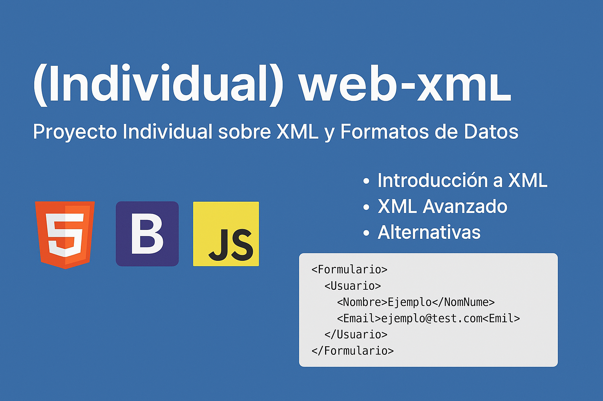

# (Individual) web-xml: Proyecto Individual sobre XML y Formatos de Datos



## Descripción del Proyecto
Este proyecto es un **fork individual** para el módulo de **Lenguaje de Marcas & Sistemas de Gestión de Información** del **1º de DAW** en el **IES Serra Perenxisa**.

## Tecnologías Utilizadas
```
- HTML5
- CSS3/Bootstrap
- JavaScript
- XML
- Markdown
```

## Contenido por Semanas

### Semana 1: Introducción a XML
```
- Historia de XML
- Sintaxis básica
- Elementos y atributos
```

### Semana 2: XML Avanzado
```
- Namespaces
- XSD
- XSLT
```

### Semana 3: Validación
```
- DTD
- Parsers
- Aplicaciones
```

### Semana 4: Alternativas
```
- YAML
- JSON
- Markdown
```

## Ejemplo de Implementación XML
Archivo `contactForm.xml`:
```
<Formulario>
  <Usuario>
    <Nombre>Ejemplo</Nombre>
    <Email>ejemplo@test.com</Email>
  </Usuario>
</Formulario>
```

## Cómo Usar
1. Clona el repositorio:
```git clone https://github.com/tu-usuario/gabi-web-xml```

2. Abre en tu navegador:
```index.html```

## ¿No puedes clonar?

1. Para poder visualizar la web, simplemente [haz click aquí.](https://g4dm.github.io/Gabi-web-xml/)

## Licencia
Creative Commons - Uso educativo

---

*Proyecto para IES Serra Perenxisa - DAW 2023/2024*